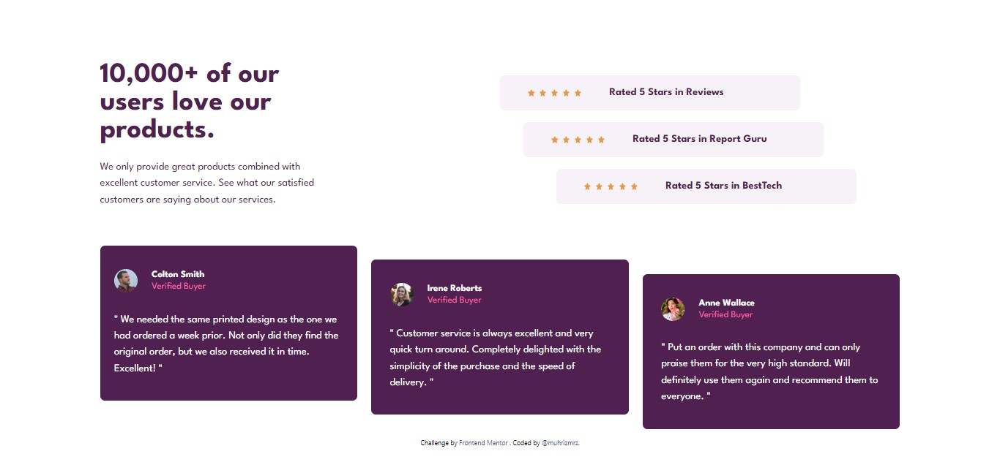

# Frontend Mentor - Social proof section solution

This is a solution to the [Social proof section challenge on Frontend Mentor](https://www.frontendmentor.io/challenges/social-proof-section-6e0qTv_bA). Frontend Mentor challenges help you improve your coding skills by building realistic projects. 

## Table of contents

- [Overview](#overview)
  - [The challenge](#the-challenge)
  - [Screenshot](#screenshot)
  - [Links](#links)
- [My process](#my-process)
  - [Built with](#built-with)
- [Author](#author)

**Note: Delete this note and update the table of contents based on what sections you keep.**

## Overview

### The challenge

Users should be able to:

- View the optimal layout for the section depending on their device's screen size

### Screenshot

### Links

- Solution URL: (https://github.com/muhrizmrz/social-proof-section-master)
- Live Site URL: (https://muhrizmrz.github.io/social-proof-section-master)

## My process

### Built with

- Semantic HTML5 markup
- CSS custom properties
- Flexbox
- Mobile-first workflow
- [Tailwind CSS](https://tailwindcss.com/) - CSS framework

### Useful resources

- [Tailwind CSS](https://tailwindcss.com/) - This helped me for CSS classes and customized classes. I really liked this pattern and will use it going forward.

## Author

- Frontend Mentor - [@muhrizmrz](https://www.frontendmentor.io/profile/muhrizmrz)